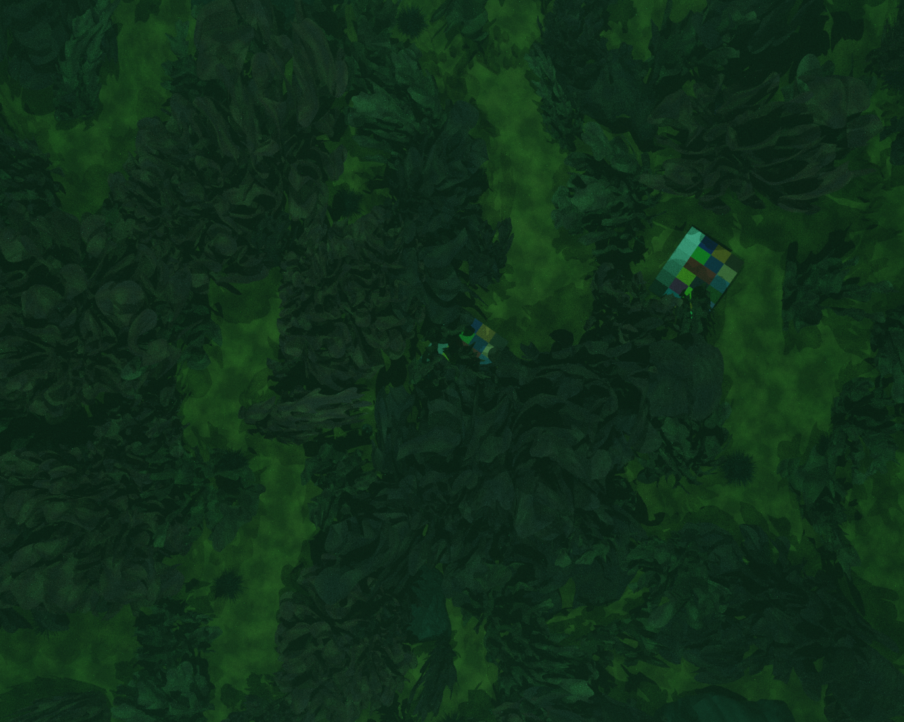
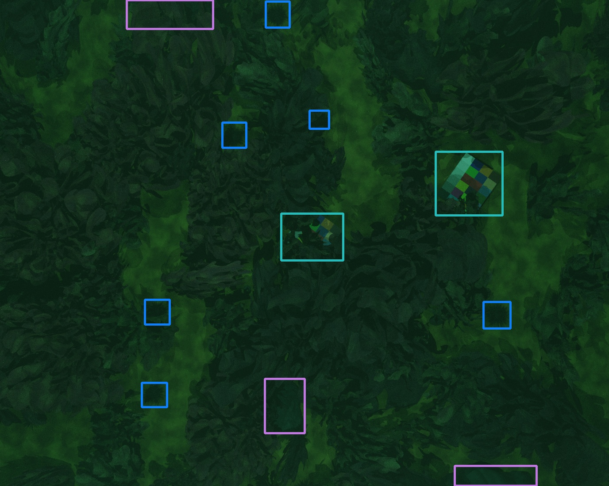

## [Synthetic image generation for benthic object detection training](https://infinigen.org)

Synthetic data generation for the paper [Training marine species object detectors with synthetic images and unsupervised domain adaptation](https://www.frontiersin.org/journals/marine-science/articles/10.3389/fmars.2025.1581778) published in 'Frontiers in Marine Science'.

<p align="center">
  
  
</p>


This repository builds on the infinigen framework for generating natural scenes with Blender ([https://infinigen.org](https://infinigen.org)).  The replacement code enhances infinigen with features to generate images from an underwater vehicle with onboard lighting.  Other enhancements include:
* Camera features including lens distortion, motion blur and sensor noise
* More realistic water including absorption and scattering using Blender 4.3 scattering phase for water 'FOURNIER_FORAND'
* Updates to underwater assets (urchins, kelp, seaweed) and new assets (handfish, colourboard, plastic bag)
* Mow the lawn animation path similar to automated survey paths.
* Improved instance segmentation masks to allow generaation of bounding boxes for object detection training.


Installation is described below and requires installation of the infinigen framework then copying the files from this repository to the infinigen directory.

This code base is completely dependent on infinigen and also uses code based on BlenderProc (distortion model, instance segmentation for generating bounding boxes).  

## Installation
Installation requires installing ([infinigen](https://infinigen.org)) so please follow it's instructions for installation and basic usage then copy the code from this repository if you are interested in the features described above.  Several files are replaced.

#### 1. infinigen installation
Please install version 1.11.x of infinigen following the installation process found at https://github.com/princeton-vl/infinigen.

Follow the installation instructions for "Installing Infinigen as a Python Module".  Use the full install.

If you want to use the Blender interface as well, also run the "Installing Infinigen as a Blender Python script" so that it installs the same version of blender.

Test the installation by running the 'Hello World' steps. Replace `desert.gin` with `coral_reef.gin` for underwater scene.

#### 2. infinigenBenthic installation
'infinigenBenthic' overwrites some of the infinigen code to give some updated features.  See Enhancements below.

After installing infinigen, infinigenBenthic can be downloaded and copied to the infinigen directory.  
Start in the directory where you installed infinigen...
```bash
cd ..
git clone https://github.com/hdoi5324/infinigenBenthic.git
cd infinigenBenthic
mv README.md README_infinigenBenthic.md
cp -r * ../infinigen
```

NOTE: to update to Blender 4.3 you'll need to repeat final installation steps for infinigen after copying over this code.  ie `pip install -e ".[terrain,vis]"
` or `bash scripts/install/interactive_blender.sh`.  This will update the Blender python module and interactive Blender to 4.3.


Update the conda environment with the following.
```commandline
pip install pycocotools
```

## Generating benthic scenes

### Demo single scenes

##### Hello World
Using the standard infinigen coral_reef scene, will use the updated water model.  
```commandline
python -m infinigen.datagen.manage_jobs --output_folder outputs/benthic_demo --num_scenes 1 --overwrite \
--configs coral_reef.gin dev.gin --pipeline_configs local_16GB.gin monocular.gin cuda_terrain.gin

```

##### infinigenBenthic demo
This configuration will use the additional enhancements from infinigenBenthic
```bash
python -m infinigen.datagen.manage_jobs --output_folder outputs/benthic_demo --num_scenes 1 --overwrite \
--configs coral_reef_hd.gin --pipeline_configs local_16GB.gin monocular.gin cuda_terrain.gin hd_coral_reef_datagen.gin
```

### Multiple scenes
From the infinigen directory execute the following.
```commandline
conda activate infinigen
bash scripts/benthic/generate_images.sh
```

Edit `generate_images.sh` for location of output and number of scenes.

`infinigen_examples/configs_nature/benthic` contains the config files used for benthic scenes.

`infinigen_examples/generate_auv_mission.py` is based on `generate_nature.py` and focuses just on underwater scenes.


## Enhancements
The infinigen blender framework has been extended with the following features

##### Underwater robotic vehicles
* Camera rig has configurable spotlights for onboard lighting.  Either a single light or two lights setup like an AUV.
* Mow the lawn camera rig animation to mimic AUV mission.
* Adjustment of camera altitude after all assets are populated to allow more consistent altitude with flying low.
* Configurable camera properties including focal length, sensor size and lens distortion. Distortion model implementation based on BlenderProc

#### Underwater scenes
* Water models light scattering and light absorbtion using Volume Absorption and Volume Scattering shaders
* Assets - Black Spiny Urchin, Kina Urchin, Handfish, plastic bags, colourboard
* Materials - mixed underwater surface - ComplexSand

#### Ground Truth
* Distinct colours for blender ground truth rendering of segmentation masks used for bounding box generation. Based on BlenderProc


## Change Log

Earlier Versions
* Add lights to camera 
* Apply distortion by calculating distortion mapping when setting up camera, changing size of photo taken then applying distortion at render.
* Mow the lawn animation
* Water absorption and scattering

December 2024
* Migrate to infinigen 1.11.x and Blender 4.3
* Updated water scattering to use FOURNIER_FORAND phase in Blender 4.3
* Adjust camera_rig position after populate to try to keep correct altitude over coral, kelp etc.


#### Outstanding Issues
* Bug: OcMesher doesn't create vertex_attributes for 'eroded'.  Logged in github.  OcMesher is used if FOV is too great (>90 degrees) for SphericalMesher.
* Issue: SphericalMesher doesn't seem to work with wide FOV used in AUVs.
* Enhancement: hidewater - render images without water to allow evaluation of water modelling

## Citation
If you would like to cite this work please use the following citation.

```
@article{Doig2025,
  title={Training marine species object detectors with synthetic images and unsupervised domain adaptation},
  author={Doig, Heather and Pizarro, Oscar and Williams, Stefan Bernard},
  journal={Frontiers in Marine Science},
  volume={12},
  pages={1581778},
  doi={10.3389/fmars.2025.1581778},
  publisher={Frontiers}
}
```
## Acknowledgements
Infinigen is an excellent framework for generating natural scenes leveraging procedural generation in Blender.  This is the foundation for this repository.  

As well as using infinigen, this work also uses code based on [BlenderProc](https://github.com/DLR-RM/BlenderProc).  Specifically, it has used BlenderProc approach to segmentation masks to support bounding box generation and lens distortion model.

The citations for these works are below:

```
@inproceedings{infinigen2023infinite,
  title={Infinite Photorealistic Worlds Using Procedural Generation},
  author={Raistrick, Alexander and Lipson, Lahav and Ma, Zeyu and Mei, Lingjie and Wang, Mingzhe and Zuo, Yiming and Kayan, Karhan and Wen, Hongyu and Han, Beining and Wang, Yihan and Newell, Alejandro and Law, Hei and Goyal, Ankit and Yang, Kaiyu and Deng, Jia},
  booktitle={Proceedings of the IEEE/CVF Conference on Computer Vision and Pattern Recognition},
  pages={12630--12641},
  year={2023}
}
```

```
@article{Denninger2023, 
    doi = {10.21105/joss.04901},
    url = {https://doi.org/10.21105/joss.04901},
    year = {2023},
    publisher = {The Open Journal}, 
    volume = {8},
    number = {82},
    pages = {4901}, 
    author = {Maximilian Denninger and Dominik Winkelbauer and Martin Sundermeyer and Wout Boerdijk and Markus Knauer and Klaus H. Strobl and Matthias Humt and Rudolph Triebel},
    title = {BlenderProc2: A Procedural Pipeline for Photorealistic Rendering}, 
    journal = {Journal of Open Source Software}
} 
```
